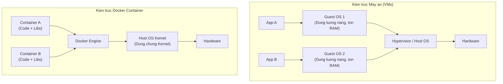
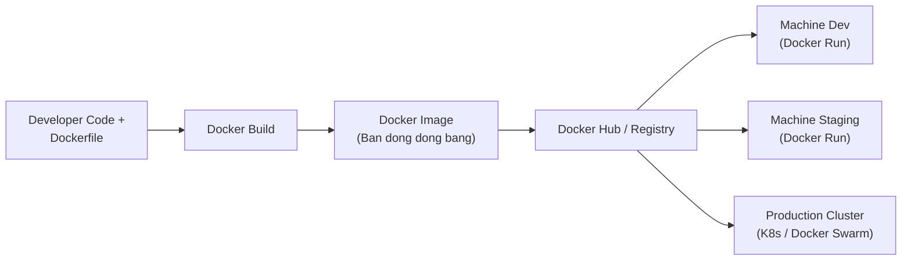

Viewed SKILL.md:1-99

### 1. Vấn đề & Bối cảnh (Problem & Context)

Trước khi có công nghệ Containerization (như Docker), môi trường phát triển phần mềm thường gặp phải sự cố kinh điển: **"Code chạy tốt trên máy của tôi (Works on my machine), nhưng lỗi trên server/máy người khác"**.

* **Máy ảo truyền thống (Virtual Machines - VMs):** Đóng gói toàn bộ hệ điều hành (Guest OS), làm cho dung lượng rất nặng (hàng GB), thời gian khởi động lâu và tiêu tốn nhiều tài nguyên hệ thống.
* **Môi trường không đồng nhất:** Máy lập trình viên chạy Windows OS, máy Tester chạy macOS, Server chạy Ubuntu Linux với các phiên bản Node.js/Python/MySQL khác nhau dẫn đến xung đột thư viện (dependency drift).

---

### 2. Mô hình tư duy cốt lõi (Core Mental Model)

**Docker Container** giải quyết triệt để vấn đề này bằng cơ chế đóng gói đóng băng: **Mọi phần phụ thuộc (Code, Runtime, System libraries, Config) được đóng gói vào một Container nhẹ duy nhất.**

Docker chia sẻ chung Kernel của OS máy host thay vì cài lại toàn bộ Guest OS, giúp Container:
1. Khởi động nhanh trong vài giây.
2. Dung lượng nhẹ (chỉ vài chục đến vài trăm MB).
3. Đảm bảo tính **Nhất quán (Consistency)** tuyệt đối trên mọi môi trường (Dev, Staging, Production).

---

### 3. Sơ đồ so sánh Kiến trúc & Trồng môi trường (Visual Diagram)

---

### 4. Luồng quy trình phát triển với Docker (Pipeline / Workflow)

---

### 5. Tác dụng cụ thể của Docker Container trong từng công đoạn

| Công đoạn | Tác dụng của Docker Container | Lợi ích thiết thực |
|---|---|---|
| **Onboarding Dev mới** | Không cần cài đặt thủ công từng thư viện, database, môi trường. Chỉ cần chạy `docker compose up`. | Rút ngắn thời gian setup môi trường từ vài ngày xuống vài phút. |
| **Phát triển (Development)** | Độc lập hóa các Dịch vụ (Microservices). Ví dụ: Chạy Redis, MySQL, PostgreSQL trong container riêng mà không làm bẩn máy thật. | Tránh xung đột phiên bản (ví dụ: dự án A cần Node 14, dự án B cần Node 18). |
| **Kiểm thử (Testing & CI/CD)** | Tạo môi trường isolated hoàn toàn để chạy Unit/Integration Test tự động, sau đó xóa bỏ sau khi test xong. | Đảm bảo kết quả test chuẩn xác, không bị ảnh hưởng bởi dữ liệu rác cũ. |
| **Triển khai (Deployment)** | Đảm bảo *Immutability* (Tính vô biến). Code chạy ở Dev đúng như thế nào thì lên Production chạy đúng như vậy. | Loại bỏ lỗi do lệch phiên bản OS hay thư viện giữa Dev và Server. |

---

### 6. Đánh giá Đổi khấu & Điểm cần lưu ý (Trade-offs)

* **Ưu điểm:**
  * Khởi động cực nhanh, tiết kiệm tài nguyên so với máy ảo.
  * Tối ưu hóa chuỗi CI/CD và kiến trúc Microservices.
  * Dễ dàng mở rộng (Scale up/down) với Kubernetes hay Docker Swarm.
* **Hạn chế & Lưu ý:**
  * Không thay thế hoàn toàn VM khi cần cách ly bảo mật ở cấp độ Kernel hoặc chạy OS khác nhân (vd: chạy ứng dụng Windows thuần trên host Linux mà không dùng emulator).
  * Việc quản lý bộ nhớ đệm (storage layer) và dữ liệu vĩnh viễn (persistent data via Volumes) đòi hỏi thiết kế cẩn thận để tránh mất dữ liệu khi container bị hủy.