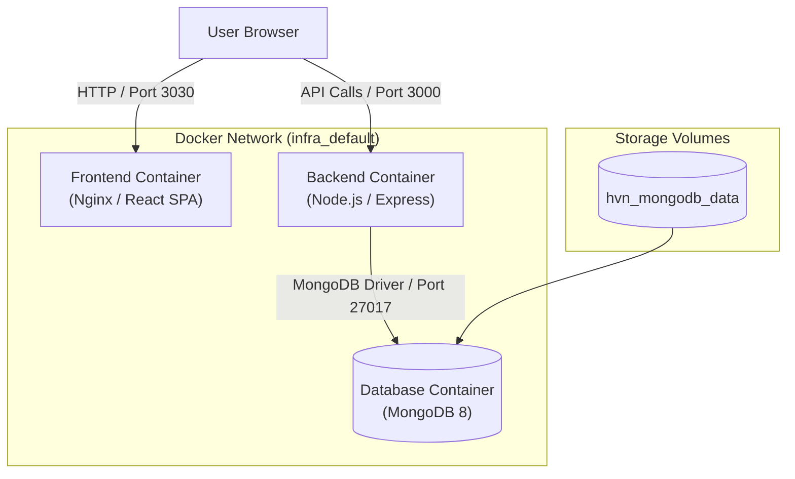

# Hướng dẫn Khởi chạy Hạ tầng và Các Dịch vụ (Infra & Services Guide)

Tài liệu này hướng dẫn cách chạy an toàn hệ thống bao gồm **MongoDB Database**, **Backend (Node.js)** và **Frontend (React/Nginx)** bằng Docker Compose.

---

## 1. Kiến trúc Hệ thống (Architecture Diagram)



---

## 2. Quản lý File Môi trường (Environment Files)

Để đảm bảo tính bảo mật và nhất quán, biến môi trường được tách biệt riêng với file cấu hình `docker-compose.yml`.

### Danh sách các File Môi trường:

- `.env.default`: File cấu hình mẫu với các giá trị mặc định dành cho **Local Development nhanh**.
- `.env.example`: File mẫu tham chiếu các biến cần thiết (được commit lên Git).
- `.env`: File cấu hình tùy chỉnh thực tế tại môi trường hiện tại (**được `.gitignore` bảo vệ, không commit lên Git**).

### Nguyên tắc chọn và chạy File Môi trường:

#### Cách 1: Khởi chạy với file `.env` mặc định (Mặc định Docker Compose tự đọc `.env`)
```bash
# Tạo file .env từ .env.default nếu chưa có
cp .env.default .env

# Khởi chạy toàn bộ dịch vụ ngầm (Detached mode)
docker compose up -d
```

#### Cách 2: Khởi chạy an toàn với chỉ định file môi trường cụ thể `--env-file`
```bash
# Khởi chạy bằng file mặc định dev (.env.default)
docker compose --env-file .env.default up -d

# Khởi chạy bằng file staging / production riêng biệt (.env.prod)
docker compose --env-file .env.prod up -d
```

---

## 3. Quản lý và Khởi chạy Dịch vụ

### A. Khởi chạy toàn bộ hệ thống
```bash
# Khởi chạy và build lại image nếu có thay đổi
docker compose --env-file .env.default up -d --build
```

### B. Khởi chạy từng Dịch vụ cụ thể

#### 1. Chỉ chạy Database (MongoDB)
```bash
docker compose up -d mongodb
```

#### 2. Chỉ chạy Database + Backend
```bash
docker compose up -d mongodb backend
```

#### 3. Chỉ chạy Frontend
```bash
docker compose up -d frontend
```

---

## 4. Kiểm tra và Xem Log Dịch vụ

```bash
# Kiểm tra trạng thái các container đang chạy
docker compose ps

# Xem log tất cả dịch vụ (theo dõi realtime)
docker compose logs -f

# Xem log từng dịch vụ cụ thể
docker compose logs -f backend
docker compose logs -f frontend
docker compose logs -f mongodb
```

---

## 5. Dừng và Hạ Hệ thống (Shutdown Commands)

### A. Dừng hệ thống an toàn (Giữ nguyên dữ liệu Database)
```bash
docker compose down
```

### B. Dừng hệ thống và Xóa sạch Volume dữ liệu (Dùng khi muốn reset lại DB từ đầu)
> [!CAUTION]
> Lệnh này sẽ **XÓA TOÀN BỘ DỮ LIỆU** MongoDB trong Volume local.

```bash
docker compose down -v
```

---

## 6. Danh sách Port mặc định

| Dịch vụ | Container Port | Host Port (Mặc định) | Biến cấu hình |
|---|---|---|---|
| **Frontend** | 3030 | `3030` | `FRONTEND_PORT` |
| **Backend** | 3000 | `3000` | `BACKEND_PORT` |
| **MongoDB** | 27017 | `27017` | `MONGO_PORT` |
